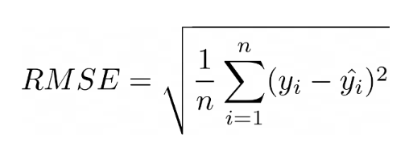
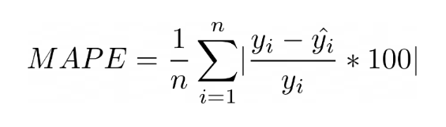
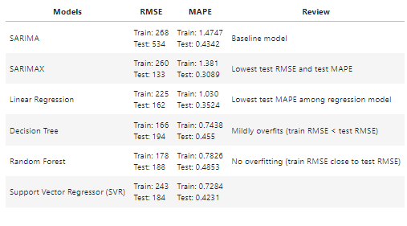

# Project 4: Predicting Dengue Cases
*By: Gloria, Nicole and Chloe*
___________________________________

## File structure
1) code
   - 1.1 Data Extraction
   - 1.2 Data Cleaning
   - 2.0 EDA
   - 3.1 Modelling_Time Series
   - 3.2 Modelling_Regression
   - 4.0 CBA
2) pkls
     - Please download pickle model file [here](https://drive.google.com/drive/folders/1MmjVV4qxu6ekcuTxdn3KB2sEYNp5UFJO) and save it under this folder
3) data
4) images

## Context

[Dengue fever](https://www.healthhub.sg/a-z/diseases-and-conditions/192/topic_dengue_fever_MOH) is a mosquito-borne viral disease caused by the bite of the Aedes mosquito. It poses a significant public health threat in tropical and subtropical regions, including Singapore. To prevent dengue fever, the key strategy is to eliminate the breeding habitats of the Aedes mosquito. The National Environment Agency (NEA) in Singapore has launched the STOP Dengue Now campaign to combat the spread of dengue by encouraging citizens to actively participate in mosquito breeding prevention.

In pursuit of effective dengue control, innovative approaches such as the Wolbachia project have been implemented. The Wolbachia method involves releasing male mosquitoes infected with the Wolbachia bacteria, which curtails the ability of Aedes mosquitoes to transmit dengue. This approach has shown promise in reducing mosquito populations and subsequently limiting disease transmission.

The factors influencing dengue transmission are complex and include weather patterns, particularly rainfall and temperature, which impact the availability of standing water for mosquito breeding. Additionally, there is evidence to suggest that online search behavior for dengue-related terms might be indicative of disease prevalence, as those at higher risk of infection may be more likely to search for information on the topic. The integration of these factors, along with the influence of the Wolbachia project, forms the basis for our comprehensive study to predict and address dengue cases and their impacts in Singapore.

### Background information on Dengue

Source: ["Dengue Prevention and 35 Years of Vector Control in Singapore" by Eng Eong Ooi et al](https://www.ncbi.nlm.nih.gov/pmc/articles/PMC3373041/).

Dengue fever (DF), dengue hemorrhagic fever (DHF), and Dengue Shock Syndrome (DSS) are diseases endemic in tropical areas like Singapore. They are transmitted principally by the Aedes aegypti mosquito (i.e. vector).

**4 serotypes**

The virus has 4 immunologically distinct serotypes. Infection confers lifelong immunity to the infecting serotype but not to the remaining 3; therefore, a person can be infected with dengue virus up to 4 times during his or her lifetime. Furthermore, epidemiologic observations suggest that previous infection increases risk for DHF and DSS in subsequent infections.

**Morbidity, treatment, and vaccination**

While DF may cause substantial morbidity, the death ratio of DHF and DSS can be as high as 30%. As yet, no specific treatment for DF or DHF is available. A vaccine is currently available, but it does not fully protect all individuals against dengue infection. It is also not recommended for individuals who have no previous dengue infection, as vaccination for uninfected individuals would lead to worsened outcomes (increased risk of having DHF/DSS).

**History of dengue in Singapore**

DHF appeared in Singapore in the 1960s and quickly became a major cause of childhood death. A vector control programme was completed in 1973 and the premises index (% of inspected premises found to have containers with *A. aegypti* larvae or pupae) since then has been low (below 5%). Despite the low premises index, there have been resurgences of dengue incidence rates.

### Problem Statement

There are 2 parts to our Problem Statement

**Part 1: Short-term prediction model** 
Develop a reasonably accurate model to predict dengue case numbers for the a subsequent short-term period (to be determined after EDA) by using:
1) Climate data; and
2) Google search trends.

Having an accurate forecast of upcoming dengue cases would allow mitigating actions to be taken by NEA, such as:
- Stepping up on premises checks with regard to potential breeding areas
- Stepping up on managing public spaces that may be potential breeding grounds, such as drains and cutting of grass/pruning of trees.
- Increased messaging to the general public with regard to ongoing dengue prevention campaigns.
- Increased roll out of Project Wolbachia

**Part 2: Cost-Benefit Analysis of Wolbachia Implementation**  
Perform a cost-benefit analysis of the Wolbachia implementation by using information from external research, and determine the decision threshold for rolling out Project Wolbachia, based on predictions from our model.

## Methodology, models and metrics

### Sources

**Data sources**
- Weather data: [weather.gov.sg](http://www.weather.gov.sg/climate-historical-daily/)
- Weekly dengue data: [data.gov.sg](https://data.gov.sg/dataset/weekly-infectious-disease-bulletin-cases)
- Google trends: [trends.google.com](https://trends.google.com/trends/explore?date=today%205-y&geo=SG&q=%2Fm%2F09wsg)

**Information sources**

*Climate*
- Overview of Singapore's climate: [weather.gov.sg](http://www.weather.gov.sg/climate-climate-of-singapore/)

*Dengue*
- [General information on Dengue in Singapore, NEA](https://www.nea.gov.sg/dengue-zika)
- [Dengue Prevention and 35 Years of Vector Control in Singapore](https://www.ncbi.nlm.nih.gov/pmc/articles/PMC3373041/)
- [Climate variability and increase in intensity and magnitude of dengue incidence in Singapore](https://www.ncbi.nlm.nih.gov/pmc/articles/PMC2799326/#:~:text=The%20weekly%20mean%20temperature%20and,elevated%20temperature%20and%20precipitation%2C%20respectively)
- [Dengue vaccine information](https://www.healthhub.sg/a-z/medications/661/Dengue%20Vaccine)

*Dengue trend explanations*
- [Epidemic Dengue during COVID-19 Pandemic - NCID Report](https://www.ncid.sg/Health-Professionals/Articles/Pages/Epidemic-Dengue-in-Singapore-During-COVID-19-Pandemic.aspx)
- [Low dengue cases in 2017](https://www.straitstimes.com/singapore/2772-dengue-cases-in-2017-the-lowest-in-the-last-16-years-nea)
- [2022 Dengue Review by The Straits Times](https://www.straitstimes.com/singapore/health/singapore-records-19-dengue-deaths-in-2022-nearly-four-times-2021-s-toll)

*Project Wolbachia*
- [Project Wolbachia information, NEA](https://www.nea.gov.sg/corporate-functions/resources/research/wolbachia-aedes-mosquito-suppression-strategy/)
- [Project Wolbachia expansion, NEA](https://www.nea.gov.sg/media/news/news/index/nea-s-project-wolbachia-singapore-to-be-expanded-to-eight-additional-sites#:~:text=Today%2C%20Project%20Wolbachia%20has%20covered,300%2C000%20homes%20will%20be%20covered)
- [Strategies to mitigate establishment under the Wolbachia incompatible insect technique, by Stacy Soh et al](https://www.mdpi.com/1999-4915/14/6/1132)
- [Economic impact of dengue in Singapore from 2010 to 2020 and the cost effectiveness of Wolbachia interventions, by Stacy Soh et al](https://www.ncbi.nlm.nih.gov/pmc/articles/PMC10021432/)

### Workflow

Below is our project workflow:

### Models

The data models used can be split into 2 main categories: Time Series Forecasting models and Regression Models.

* **Time Series Forecasting Models**
    * `SARIMA` (Seasonal Autoregressive Integrated Moving Average) and `SARIMAX` (Seasonal Autoregressive Integrated Moving Average with Exogenous Variables) are used, since we are analyzing and predicting time-dependent data.
    * Instead of the ARIMA and ARIMAX, we used SARIMA and SARIMAX they can handle seasonality, since our data likely has recurring patterns, such as yearly or monthly fluctuations (as dengue is related to weather conditions).
    * SARIMAX is an extension of our baseline SARIMA model, allowing for the inclusion of exogenous variables. 

* **Regression Models**
    * `Decision Tree`, `Random Forest` and `SVM` (Support Vector Machines) will be tested as well.
    * Decision Trees have clear interpretability and allows us to inspect the relative importance of different features in making predictions. 
    * Random Forest models are robust and  can automatically perform feature selection by evaluating the importance of each feature across multiple trees. 
    * SVM is effective in capturing complex relationships between predictors and the target variable.

### Metrics

Since the audience would be a mix of technical and non-technical people, it would be beneficial to present both RMSE and MAPE.

**Root Mean Square Error (RMSE)**

For optimisation and selection of models, we will use RMSE for the following reasons:
1) Widely used: RMSE is widely used as a metric for regression problems.  
2) Ease of interpretation: RMSE is expressed in the same units as the target variable, making it easy to interpret.
3) Sensitivity to errors: RMSE gives more weight to larger errors (as errors are squared) compared to other metrics like MAE (mean absolute error) and MAPE (mean absolute percentage error).
    - In this case where our target variable (number of dengue cases) has a large range (peaks and troughs due to seasonality), we may expect larger errors on the high peak values in absolute terms (given the higher underlying value).
    - Given the nature of the problem (dengue outbreak prediction), we would be more interested in predicting those peaks accurately.
    - Therefore, sensitivity to large errors would be especially desirable in this context.

**Mean Absolute Percentage Error (MAPE)**

For presentation and dashboarding, we will also use MAPE due to its ease of interpretability, especially for non-technical audiences who would intuitively make comparisons with percentage change/error.  

*Note: We would not use MAPE for model optimisation and selection as MAPE penalises errors on smaller values, with large error values for actual values that are close to 0 (as the actual values form the denominator of the error formula, and dividing by a small number would yield a large number). This is counter to our focus on predicting the peaks correctly (rather than the low troughs).*

## EDA findings

### Dengue peaks and troughs

*Troughs*
- There was a period of low dengue rates in 2017 and 2018. According to a [report](https://www.straitstimes.com/singapore/2772-dengue-cases-in-2017-the-lowest-in-the-last-16-years-nea) in The Straits Times, this may be attributed to 3 possible reasons:
1) Build up of herd immunity after dengue outbreaks in previous years;
2) Increased vector control efforts by NEA and the community after the Zika outbreak in second half of 2016;
3) The introduction of 50,000 Gravitraps (traps that catch Aedes aegypti mosquitoes and collect data on them) across the island.

*Peaks*
- The outbreaks in 2020 and 2022 were significantly worse than the previous outbreaks in 2013, 2014, 2016 and 2019. 
- The outbreak in 2020 was explored in an [article](https://www.ncid.sg/Health-Professionals/Articles/Pages/Epidemic-Dengue-in-Singapore-During-COVID-19-Pandemic.aspx) published by an epidemiologist at NCID, stating the possible contributory factors as follows:
    1) Change in prevalent serotype from DEN-1 and DEN-2, to DEN-3 and DEN-4 during this outbreak, so there was lower herd immunity to these strains;
    2) Dengue transmission in/near homes due to the increase in work-from-home as part of COVID-19's safe management measures;
    3) Humidity and warmer temperatures.
- For 2022, an [article](https://www.straitstimes.com/singapore/health/singapore-records-19-dengue-deaths-in-2022-nearly-four-times-2021-s-toll) in The Straits Times reported that 62.3% of the 2022 cases were of DEN-3 serotype, which may have led to increased transmission due to lower herd immunity.

### Dengue seasonality and time-lag with weather factors

- Dengue tends to peak in the middle of the year, in Jun-Jul.
- This peak follows a period of increasing mean monthly temperatures, with a lag time of ~1-2 months that decreases as temperature increases.
- In general, the time lag between climate factors and dengue incidence may be accounted for by:
    1) The time it takes for Aedes mosquitoes to go through their life (~6 days or less)
    2) Extrinsic incubation period, or the time from a mosquito biting an infected person to the time it may then infect others (~7-14 days)
    3) Time taken for a bitten individual to exhibit dengue symptoms (5-7 days)

### Dengue and temperature

Source: [Climate variability and increase in intensity and magnitude of dengue incidence in Singapore, Yien Ling Hii et al](https://www.ncbi.nlm.nih.gov/pmc/articles/PMC2799326/)

What epidemiologists have found is that temperature could affect the Aedes mosquito's:
1) Population size
2) Maturation period
3) Feeding characteristics
4) Survival rates

- At 15-30 degrees (Celsius), adult Aedes mosquitoes experience lower mortality rates
- At 32 degrees, Aedes mosquitoes:
  - Have shorter reproductive cycles
  - Pupae development may reduce to less than 1 day (from 4 days at 22 degrees)
  - Feeding frequency increases more than 2-fold (compared to at 24 degrees)
  - Extrinsic incubation period of Dengue viruses shortens to 7 days (from 12 days at 30 degrees)

We can see this shortening of cycles in the above chart, with the lag time reducing as temperature increases.

### Correlations between features and dengue
* The strongest relationships were found between google dengue search trends and dengue
* Relationships between climate factors and dengue were moderate to very weak, with max daily temperature having the strongest correlation with dengue
* However, these correlations were diluted as we had to lag these features by 12 weeks in relation to our target y-variable (dengue cases) to allow for our 12-week prediction window.

### Prediction window

From the information above on how weather features take about 3-4 weeks to impact dengue numbers, our prediction window should be no less than this lag as any lesser would mean that it would be too late to act. Hence, minimum prediction window should be 12 weeks, to provide some lead time to act.

We would be trying out our model on 2 prediction windows: 52 weeks (1 year) and 12 weeks (3 months). As such, practically, we would not have access to data 52 (or 12) weeks ahead at the time of prediction. Therefore, data would have to be lagged by the prediction window as a minimum.

Furthermore, with observations and research about how weather features take about 3-4 weeks to impact dengue numbers, weather features will need to be lagged by an additional 3 weeks (choose lower end of range due to generally higher temperatures in Singapore reducing reproductive cycles and extrinsic incubation period).

## Conclusion of model results

We explored a 52-week prediction window, versus the 12-week prediction window on the SARIMAX model, as well as various 12-week predictions for different quarters of 2022. Here are some key observations:  

* **Enhanced Short-Term Accuracy:**   The 12-week model demonstrates stronger predictive capability when operating within the shorter three-month intervals. The model's accuracy improves when focused on immediate changes and fluctuations within the data, resulting in more accurate predictions for these compact timeframes.

* **Differential Performance in Trends:**   Comparing across the various quarters of predictions, the 12-week model excels in accurately predicting downward trends in dengue cases. However, it exhibits challenges in effectively capturing upward spikes or surges in cases. This suggests that the model may require more complex data inputs to capture factors that contribute to surges, such as serotype information that can significantly impact the dynamics of dengue outbreaks.

From these findings, we decided to focus on testing the 12-week prediction window for the remaining models. We will be predicting the first quarter of 2022 (Jan to Mar) as we are interested to see if our model is able to predict the initial spike of a potential dengue outbreak.

Results are as follows:

Sarimax is the best performing model with test RMSE of 133 and MAPE of 0.31. However, the model is still not capturing the spike of the dengue cases well enough.

### Model improvement suggestions

Increase the number of features, as other intervening factors were found as part of EDA:
1) Percentage of each circulating serotype for each year
2) Serological information to understand underlying population immunity
3) Premises index (Percentage of premises visited by NEA with Aedes larvae found) to get a sense of vector control

## Cost-benefit analysis

### Sources

Information on lost time and economic cost of dengue, and the cost of Wolbachia was taken from a [study](https://www.ncbi.nlm.nih.gov/pmc/articles/PMC10021432/) by Stacy Soh et al, on the "Economic impact of dengue in Singapore from 2010 to 2020 and the cost-effectiveness of Wolbachia interventions". 

Information on Wolbachia was obtained from [NEA](https://www.nea.gov.sg/corporate-functions/resources/research/wolbachia-aedes-mosquito-suppression-strategy/frequently-asked-questions) FAQ for Wolbachia.

### Assumptions

- Lost time per dengue incidence: 7 days
- Economic loss per day lost: USD 300 (2010$)
- Expansion factor: 3 (to account for unreported cases)
- Wolbachia cost: USD 22.7m (2010$)
- Wolbachia efficacy: 50%

Using the above assumptions, it would be cost effective to roll out Wolbachia if annual dengue cases exceeds **7,200 cases**.

### CBA conclusion: Decision threshold considering model error margin

With a MAPE  of 0.3, there will be some error to the model predictions and there may be:
1) Overpredictions when the model recommends to roll out Wolbachia when it is not actually cost effective; and
2) Underpredictions when the model recommends not to roll out Wolbachia when it is actually cost effective.

We charted the cost of these errors across predictions from 5000 to 9750 and found that the decision threshold which reduces this cost of error is when the model predicts 6000 dengue cases and above. Estimated cost of error for this threshold is USD 5.1m in 2010$.

